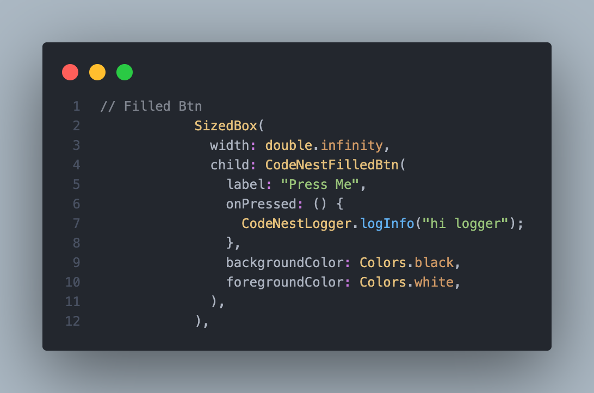

# 📱 code_nest_ui

`code_nest_ui` is a Flutter package providing a set of reusable and customizable UI components. It
helps developers quickly build modern, clean, and responsive user interfaces in their Flutter
applications.

---

## ✨ Features

- Beautiful pre-styled widgets
- Consistent design system
- Easy-to-integrate components
- Fully responsive and theme-friendly

---

## 🖼️ CodeNest Validators

### 📧 Email Validator

Validates a well-formed email input field.  


---

### 🔐 Password Validator

Checks for minimum length and optionally special characters.  


---

### 🧍 Username Validator

Ensures username is not empty and meets length requirements.  


---

### 🔢 Number Validator

Accepts only numeric values as input.  


---

### 🔑 PIN Validator

Validates a 4- or 6-digit numeric PIN input.  


---

### 🌐 URL Validator

Checks if the input is a valid URL.  


---

## 🧱 CodeNest Spacers
code_nest_ui provides handy spacer widgets to improve layout readability and maintain consistent
spacing across your app UI.

### ↕️ CodeNestVerticalSpacer

Adds vertical space between widgets.


---

### ↔️ CodeNestHorizontalSpacer

Adds horizontal space between widgets.


---

## 🖼️ 🔔 SnackBar Utilities – Success & Failure Toasts – Code Preview

The code_nest_ui package includes quick and easy utilities to show consistent feedback to users
using Flutter’s SnackBar.

### ✅ Success SnackBar

Use this to notify users of a successful action (e.g., form submitted, data saved).


---

### ❌ Failure SnackBar

Use this to indicate an error or failed operation (e.g., validation failed, network error).


---

## 📋 CodeNestLogger 

The code_nest_ui package includes lightweight, categorized logging utilities to help you debug,
trace responses, and monitor app behavior consistently.

Use these loggers throughout your app to improve visibility during development or debugging.

### ❌ Error Logger

Logs critical errors such as exceptions, failures, or crashes.


---

### ℹ️ Info Logger

Logs general-purpose messages for debugging or tracking flow.


---

### 🔁 Response Logger

Logs formatted API or service responses (JSON, status codes, etc.).


---

### ⚠️ Warning Logger

Logs non-critical issues that may need attention (e.g., deprecated API usage, retry needed).


---

## 📝 Typography – CodeNestText

The CodeNestText widget in code_nest_ui makes it easy to apply consistent, customizable, and styled
text across your Flutter application.

---

### 🔤 Normal Text

Displays styled plain text with support for font size, color, weight, and alignment.


---

### 🧩 Rich Text

Displays multiple text spans with varied styles in a single line or paragraph.


---

### 🖋️ Outlined Text

Shows text with a stroke (outline) effect, great for bold headers or banner text.


---

## 💬 CodeNestTooltip

The CodeNestTooltip widget enhances accessibility and UX by providing helpful hover or long-press
messages on any UI element.

Use it to show contextual information, labels, or descriptions without cluttering your layout.

---

### 🛠️ ToolTip

Displays helpful text when the user hovers (web/desktop) or long-presses (mobile) on a widget.


---

## 🔘 CodeNestSwitch

The CodeNestSwitch widget provides a reusable and consistent toggle switch UI for enabling or
disabling settings, toggles, and preferences across your app.

It wraps Flutter’s native Switch widget but adds support for cleaner syntax and design-system
consistency.


---

### 🔳 Switch

Use the switch to represent on/off states like dark mode, notifications, etc.


---

## 🧭 CodeNest UI Navigation

The code_nest_ui package provides a collection of pre-styled, reusable navigation widgets that help
structure and navigate your app seamlessly across mobile, tablet, and desktop platforms.

---

### 🧱 CodeNestAppBar

A consistent top app bar across screens.


---

### 🧱 CodeNestBottomNavBar

A tab-like bottom navigation for switching main sections.


---

### 🧱 CodeNestDrawer

A collapsible side drawer for secondary or grouped items.


---

### 🧱 CodeNestNavigationBar (Material 3)

A Material You navigation bar with active indicators.


---

### 🧱 CodeNestNavigationRail

A side-positioned navigation rail for large screens.


---

### 🧱 CodeNestTabBar

A top-positioned tab bar for switching between content sections.


---

## 🖼️ CodeNestImage

The code_nest_ui package provides multiple image handling widgets that make it easy to display
images from local assets, network sources, SVGs, and cached content with graceful fallbacks and
styling.

---

### 📦 Asset Image 

Display images stored locally in your app's assets folder.


---

### 🌐 Network Image

Display a basic image from a URL.


---

### ⚡ Cached Network Image 

Display network images with caching and loading placeholder/fallback support.


---

### 🧾 SVG Image

Render SVG images from assets or network.


---

## 🔄 CodeNestLoaders

The code_nest_ui package includes beautiful and reusable loading widgets to indicate progress,
waiting states, or content placeholders across your app.

---

### 🔘 Circular Progress Loader 

A customizable circular loading indicator.


---

### ✨ Shimmer Loader

Displays animated placeholders using a shimmer effect.


---

## 🎞️  CodeNestLottieAnimations

code_nest_ui includes pre-configured animation widgets using Lottie to add beautiful, lightweight, vector-based animations to your Flutter app.

---

### 🎨 Lottie Asset Animation 
Plays a .json Lottie file from your local assets/ directory.


---

### 🎨 Lottie Network Animation 
Plays a .json Lottie animation from a network URL.


---

## 🔘  CodeNestButtons
The code_nest_ui package provides a collection of pre-styled and reusable button components designed for speed, consistency, and customization.

---

### 🔹 Filled Button 
A high-emphasis button for primary actions..



---

### 🔹  Filled Icon Button 
A filled button with an icon and label.


---


### 🔹  Icon Button (Material)
Simple tappable icon using Material icons.


---

### 🔹  Icon Button (SVG)
Tappable icon button with an SVG icon.


---

### 🟦   Outlined Button 
A low-emphasis action button with a border.


---

### 🟦    Icon Outlined Button 
An outlined button with an icon and label.


---

### 🟦    Icon Outlined Button (SVG) 
An outlined button with an SVG icon and label.


! [Icon Outlined Button(SVG)](assets/images/Btns/icon-outlined-btn-with-svg.png)

---

### 🧩     Segmented Button 
A set of mutually exclusive or multi-select button segments.


! [Segmented Button](assets/images/Btns/segmented-btn.png)

---

## ➖  CodeNestDivider 
The code_nest_ui package offers a set of customizable dividers to visually separate content and improve layout clarity.

---


### 🟫      Solid Horizontal Divider 
A classic horizontal line divider with customizable thickness, color, and margin.


! [Divider](assets/images/Divider/solid-horizontal-divider.png)

---


### 🟪      Dashed Vertical Divider 
A vertical dashed line, often used between two sections in a Row.


! [Dashed Divider](assets/images/Divider/dashed-vertical-divider.png)

---

### 🟪      Dotted Divider 
A dotted horizontal line to subtly separate sections.


! [Dotted Divider](assets/images/Divider/dotted-divider.png)

---

## 📦   CodeNestContainer
CodeNestContainer is a flexible, reusable layout widget that wraps Flutter’s Container with enhanced customization options. It helps maintain consistency in spacing, decoration, and theming across your app.

---

### 🟪      Container
Best for: wrapping content, sections, cards, buttons, headers.


! [Container](assets/images/Container/container.png)

---

## 📦   CodeNestFormField 
The code_nest_ui package provides beautifully styled, reusable form fields to speed up form creation and enforce design consistency.

---

### 🔤      Text Form Field 
A customizable input field for single-line text input.


! [TextFormField](assets/images/FormField/text-form-field.png)

---


### 🔽      Dropdown Form Field 
A dropdown selector styled like a text field.


! [DropDownTextFormField](assets/images/FormField/dropdown-text-form-field.png)

---


### 📄      Multi-line Text Form Field
A multi-line input field for longer text.


! [MultiLineTextFormField](assets/images/FormField/dropdown-text-form-field.png)

---

### 🔐      Password Text Form Field 
A secure text field with toggle visibility.


! [Password TextFormField](assets/images/FormField/password-text-form-field.png)

---

### 🔐      Password Text Form Field 
A secure text field with toggle visibility.


! [Password TextFormField](assets/images/FormField/password-text-form-field.png)

---

### 📆       Picker Text Form Field – CodeNestPickerFormField
A read-only input that opens a picker (e.g., date, time, custom selection).


! [Picker TextFormField](assets/images/FormField/picker-text-form-field.png)

---

---

## 🚀 Getting Started

To use this package, add the following to your `pubspec.yaml`:

```yaml
dependencies:
  code_nest_ui: ^0.0.6
